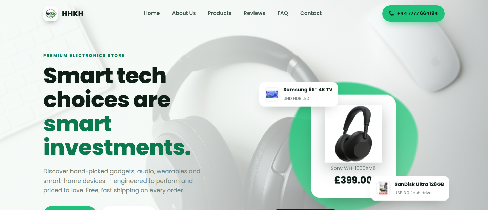

<div align="center">


# hhkh — Premium Electronics Storefront

**Wholesale electronics storefront for [H &amp; H Kent Holdings Ltd](https://hhkh.co.uk)** — TVs, headphones, office equipment and storage, sold B2B at wholesale.

[](https://www.hhkh.co.uk)
&nbsp;

&nbsp;


🌐 **Live:** [www.hhkh.co.uk](https://www.hhkh.co.uk)



</div>

---

## Overview

A fast, fully responsive single-page storefront for **hhkh** (H &amp; H Kent Holdings Ltd), a UK electronics wholesaler based in Slough. The site presents a curated catalogue, lets buyers browse and filter products, and sends **wholesale enquiries** (minimum order **100 pcs**) rather than running a retail checkout.

## Features

- 🛍️ **Product catalogue** — searchable, category-filtered grid with load-more paging
- 🔍 **Product detail modal** — specs, pricing, ratings and a direct enquiry action
- 📦 **Wholesale-first** — MOQ badges throughout; "Add to cart" replaced with **Enquire**
- 📱 **Mobile-friendly** — responsive across phones, tablets and desktop
- ⚡ **Smooth UX** — scroll-reveal animations, sticky header, back-to-top, cookie consent
- 🎨 **Branded** — custom HHKH logo, favicons and PWA web manifest
- 🚀 **Deployed on Vercel** with a custom domain

## Tech stack

| Area        | Choice                                  |
| ----------- | --------------------------------------- |
| Framework   | [React 18](https://react.dev)           |
| Build tool  | [Vite 5](https://vitejs.dev)            |
| Icons       | lucide-react, react-icons               |
| Hosting     | [Vercel](https://vercel.com)            |
| Language    | JavaScript (JSX) + CSS                   |

## Getting started

```bash
# install dependencies
npm install

# start the dev server (http://localhost:5173)
npm run dev

# create a production build in dist/
npm run build

# preview the production build locally
npm run preview
```

## Project structure

```
src/
├── components/    # UI sections — Hero, Products, ProductModal, Header, Footer, …
├── data/
│   ├── site.js     # central business details (name, contact, address)
│   ├── products.js # normalises the catalogue into the storefront shape
│   └── argos.json  # raw product source data
├── hooks/         # custom hooks (e.g. scroll reveal)
└── assets/        # logo and image assets
public/            # favicons, app icons and web manifest
docs/              # README assets
```

## Deployment

The site is hosted on **Vercel** and aliased to the custom domain **[www.hhkh.co.uk](https://www.hhkh.co.uk)**. Every push to `master` can be promoted to production:

```bash
npx vercel --prod
```

## Contact

**H &amp; H Kent Holdings Ltd** · Slough, England
🌐 [hhkh.co.uk](https://www.hhkh.co.uk) · ✉️ info@hhkh.co.uk

---

<div align="center">
<sub>© H &amp; H Kent Holdings Ltd. All rights reserved.</sub>
</div>
